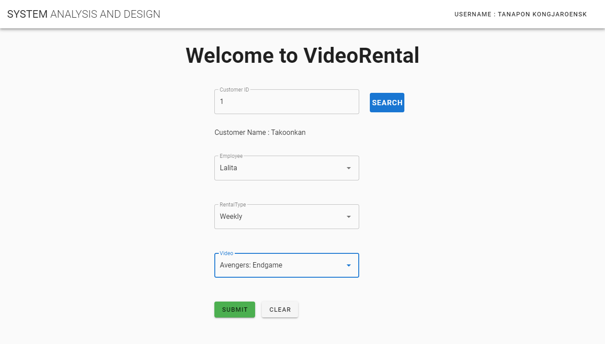

<p align="center">
  
</p>

# VueJs-SpringBoot
System Analysis and Design 62/1

# Backend RUN
```
- cd backend
- ./gradlew bootRun
```

# Fronend RUN
```
- install Node & Yarn
- yarn global add @vue/cli@3.9.3
- cd cliend
- npm install
- yarn serve
```

# Database H2
- http://localhost:9000/h2-console/ 
- JDBC URL ใส่ค่าเป็น jdbc:h2:mem:testdb

# System Activity Diagram
<p align="center">
  
</p>

# Class Diagram
<p align="center">
  
</p>


